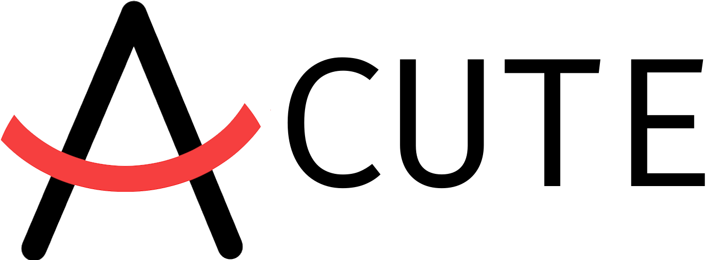

  

  
  

-----

  <strong> Modular Data Driven Physics and Render Engine (unusable yet) </strong> for the rust programming language

-----

  <strong> Note: </strong> this projects "contains two projects" right now as implementing the ecs requires a rewrite with the current architecture.
  In addition, I am not yet satisfied with the new scene architecture as swapping scenes is not really do-able right now.

